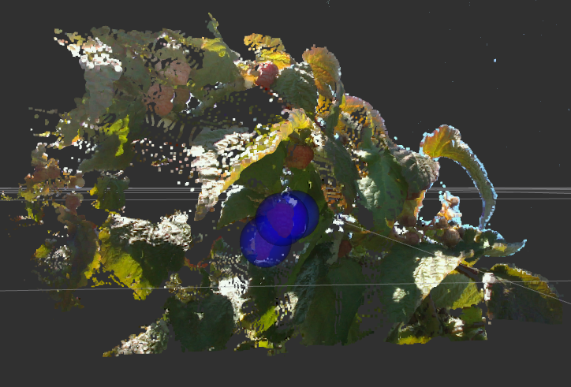

# raspberry_package
This is my master thesis. In project we detect raspberries and locate them in 3D. For project we use lidar camera Intel Realsense L515.
The input data is rgb, depth image and pointcloud, as shown below on photos.

## YOLO weights and config

 